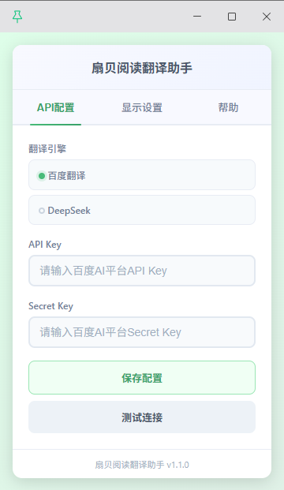
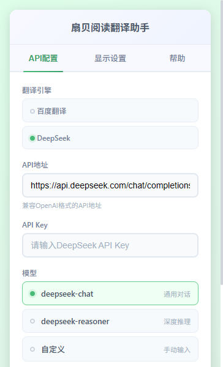
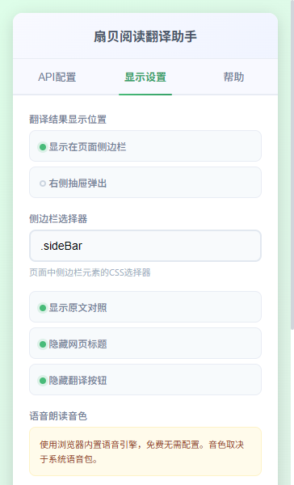
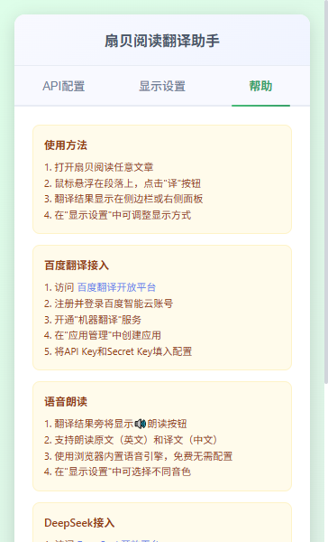

# 扇贝阅读翻译助手 (ShanBay Translate Helper)

一个强大的Chrome浏览器扩展，为扇贝阅读网站添加段落翻译和语音朗读功能，支持百度翻译和DeepSeek双引擎。

## 功能特点

- **智能段落识别**：自动识别扇贝阅读文章中的段落，支持多种选择器
- **悬浮翻译按钮**：鼠标悬浮在段落上显示翻译按钮，不影响阅读体验
- **多引擎支持**：支持百度翻译API和DeepSeek AI大模型
- **翻译结果缓存**：避免重复翻译，提升效率
- **双显示模式**：支持侧边栏显示和右侧抽屉弹出
- **语音朗读**：翻译结果支持语音朗读，可朗读原文和译文
- **音色选择**：支持选择不同的浏览器语音音色
- **右键翻译**：选中文本后右键即可翻译
- **替换官方按钮**：自动替换扇贝阅读官方翻译按钮
- **配置持久化**：配置信息自动保存，重启后无需重新设置

## 应用截图

| 截图 | 说明 |
|------|------|
|  | 百度翻译API配置 |
|  | DeepSeek API配置 |
|  | 显示设置选项 |
|  | 帮助说明 |

## 项目结构

```
shanTrans/
├── manifest.json              # Chrome扩展配置文件
├── src/                       # 源代码目录
│   ├── content/              # 内容脚本
│   │   ├── content.js        # 主内容脚本
│   │   └── content-debug.js  # 调试版本
│   ├── background/           # 后台脚本
│   │   └── background.js     # API调用处理
│   ├── popup/                # 弹出窗口
│   │   ├── popup.html        # 配置界面
│   │   └── popup.js          # 配置逻辑
│   ├── styles/               # 样式文件
│   │   └── styles.css        # 插件样式
│   └── utils/                # 工具脚本
│       ├── analyze.js        # 页面分析
│       └── bookmarklet.js    # 书签版
├── icons/                    # 图标目录
│   ├── icon16.png           # 16x16图标
│   ├── icon32.png           # 32x32图标
│   ├── icon48.png           # 48x48图标
│   ├── icon128.png          # 128x128图标
│   ├── icon.svg             # SVG源文件
│   └── generate-icons.html  # 图标生成器
├── tools/                    # 工具目录
│   ├── create-icons.html    # 图标生成工具
│   ├── test.html            # 测试页面
│   └── ...                  # 其他工具
├── package.json              # 项目配置
├── build.bat                 # 构建脚本
└── README.md                 # 说明文档
```

## 安装步骤

### 1. 生成图标文件（如果尚未生成）

1. 打开 `tools/create-icons.html` 或 `icons/generate-icons.html`
2. 点击生成图标按钮
3. 保存图标到 `icons` 目录：
   - `icon16.png`
   - `icon32.png`
   - `icon48.png`
   - `icon128.png`

### 2. 安装插件到Chrome

1. 打开Chrome浏览器，访问 `chrome://extensions/`
2. 开启右上角的"开发者模式"
3. 点击"加载已解压的扩展程序"
4. 选择本项目文件夹
5. 插件图标将出现在浏览器工具栏

### 3. 配置翻译API

#### 方式一：百度翻译API（推荐）

1. 访问 [百度AI平台](https://cloud.baidu.com/product/mt)
2. 注册并登录百度智能云账号
3. 开通"机器翻译"服务
4. 创建应用，获取API Key和Secret Key
5. 点击浏览器工具栏中的插件图标
6. 选择"百度翻译"引擎
7. 输入API Key和Secret Key
8. 点击"保存配置"
9. 点击"测试连接"验证配置

#### 方式二：DeepSeek API

1. 访问 [DeepSeek开放平台](https://platform.deepseek.com/)
2. 注册并登录账号
3. 进入"API Keys"页面创建Key
4. 点击浏览器工具栏中的插件图标
5. 选择"DeepSeek"引擎
6. 输入API Key
7. 选择模型（deepseek-chat推荐）
8. 点击"保存配置"
9. 点击"测试连接"验证配置

## 使用方法

### 基础使用

1. 访问扇贝阅读文章页面（`https://web.shanbay.com/*` 或 `https://www.shanbay.com/*`）
2. 鼠标悬浮在文章段落上，右侧会出现绿色"译"按钮
3. 点击按钮，翻译结果将在侧边栏或右侧面板显示
4. 再次点击"译"按钮可关闭翻译结果

### 右键翻译

1. 在扇贝阅读页面选中任意英文文本
2. 右键点击，选择"翻译选中内容"
3. 翻译结果将显示在侧边栏或右侧面板

### 显示设置

点击插件图标，切换到"显示设置"标签：

- **显示位置**：
  - 侧边栏：翻译结果显示在页面右侧侧边栏
  - 右侧抽屉：翻译结果以抽屉形式从右侧弹出

- **显示选项**：
  - 显示原文对照：同时显示原文和译文
  - 隐藏网页标题：隐藏浏览器标签页标题
  - 隐藏翻译按钮：隐藏段落上的"译"按钮（可通过右键翻译）

- **语音朗读**：
  - 使用浏览器内置语音引擎，免费无需配置
  - 可选择英文和中文音色
  - 翻译结果旁显示🔊按钮，点击即可朗读

## 配置说明

### API配置

| 配置项        | 百度翻译                                                 | DeepSeek                                                                      |
|------------|------------------------------------------------------|-------------------------------------------------------------------------------|
| API Key    | 百度AI平台API Key                                        | DeepSeek API Key                                                              |
| Secret Key | 百度AI平台Secret Key                                     | -                                                                             |
| API地址      | 默认: https://aip.baidubce.com/rpc/2.0/mt/texttrans/v1 | 默认: https://api.deepseek.com/chat/completions                                 |
| 模型         | -                                                    | deepseek-chat / deepseek-reasoner / 自定义                                       |
| 地址         | [百度通用翻译](https://ai.baidu.com/ai-doc/MT/4kqryjku9 )  | [deepseek对话](https://api-docs.deepseek.com/zh-cn/api/create-chat-completion)  |

### 显示配置

| 配置项 | 说明 | 默认值 |
|--------|------|--------|
| 显示模式 | sidebar 或 panel | sidebar |
| 侧边栏选择器 | 页面中侧边栏元素的CSS选择器 | .sideBar |
| 显示原文 | 是否显示原文对照 | true |
| 隐藏标题 | 是否隐藏网页标题 | false |
| 隐藏按钮 | 是否隐藏翻译按钮 | false |

## 开发说明

### 技术栈

- Chrome Extension Manifest V3
- 百度AI平台翻译API
- DeepSeek API（兼容OpenAI格式）
- MutationObserver（监听页面动态内容变化）
- CSS3 动画和过渡效果

### 核心文件说明

- `src/content/content.js` - 内容脚本，注入到网页中
  - 段落识别和翻译按钮创建
  - 翻译结果展示（侧边栏/面板）
  - 语音朗读功能（Web Speech API）
  - MutationObserver监听DOM变化

- `src/background/background.js` - 后台脚本，处理API调用
  - 百度翻译API集成
  - DeepSeek API集成
  - 翻译缓存管理
  - 右键菜单处理

- `src/popup/` - 弹出窗口界面和逻辑
  - API配置管理
  - 显示设置管理
  - 配置测试功能

- `src/styles/styles.css` - 插件样式
  - 翻译按钮样式
  - 侧边栏/面板样式
  - 通知样式
  - 响应式适配

### 构建

运行 `build.bat` 脚本生成发布包：

```bash
build.bat
```

生成文件：`shanbay-translate-helper.zip`

### 调试

1. 在Chrome扩展页面点击"背景页"链接，打开开发者工具查看后台脚本日志
2. 在扇贝阅读页面打开开发者工具，查看内容脚本日志
3. 使用 `src/content/content-debug.js` 进行调试（需要手动替换）

## 常见问题

### Q: 安装后没有看到翻译按钮？

A: 请确认：
1. 已正确配置API Key
2. 当前页面是扇贝阅读文章页面
3. 页面已加载完成

### Q: 翻译失败怎么办？

A: 请检查：
1. API Key是否正确
2. 网络连接是否正常
3. API配额是否用完
4. 查看浏览器控制台错误信息

### Q: 如何切换翻译引擎？

A: 点击插件图标，在"API配置"标签中选择翻译引擎，保存配置即可。

### Q: 翻译结果不显示在侧边栏？

A: 可能原因：
1. 侧边栏选择器不正确，在"显示设置"中调整
2. 页面结构发生变化，尝试使用"右侧抽屉"模式

### Q: 如何隐藏翻译按钮？

A: 在"显示设置"中勾选"隐藏翻译按钮"，保存设置。之后可通过右键翻译功能翻译文本。

## 引擎对比

| 特性 | 百度翻译 | DeepSeek |
|------|----------|----------|
| 翻译速度 | 快 | 较快 |
| 翻译质量 | 专业 | 优秀 |
| 上下文理解 | 一般 | 强 |
| 价格 | 按字符计费 | 按token计费 |
| 稳定性 | 高 | 高 |
| 推荐场景 | 日常使用 | 需要更准确翻译 |

## 许可证

MIT License

## 更新日志

### v1.1.0 (2026-05-27)

- 新增语音朗读功能（浏览器内置Web Speech API）
- 新增音色选择设置（英文/中文音色可选）
- 优化翻译体验：点击翻译后立即显示原文，译文稍后填充
- 翻译时自动停止正在播放的朗读
- 关闭翻译面板时自动停止朗读
- 修复朗读被打断时的错误提示问题

### v1.0.0 (2026-05-26)

- 初始版本发布
- 支持百度翻译API
- 支持DeepSeek API
- 侧边栏和面板双显示模式
- 右键翻译功能
- 翻译缓存功能
- 配置持久化
